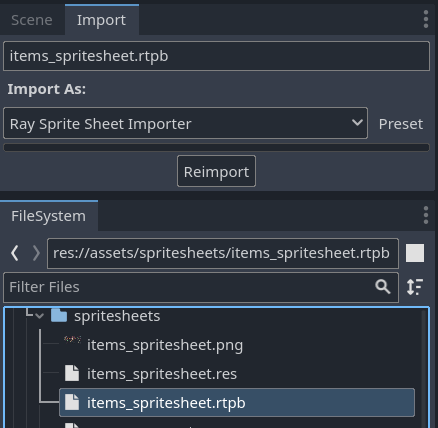
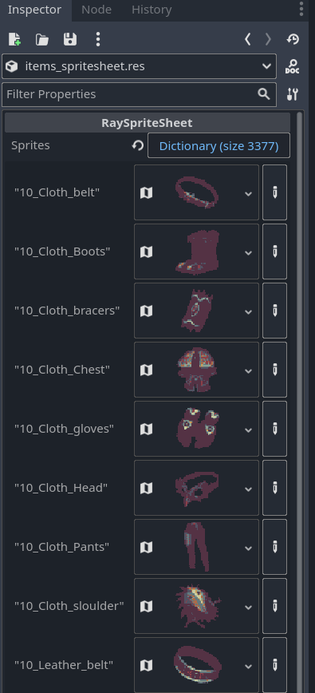
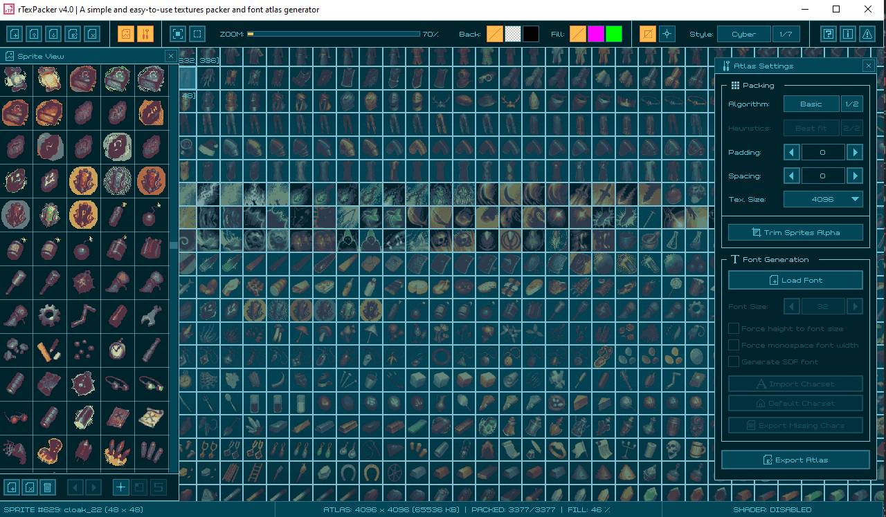

# Godot rTexPacker SpriteSheet Importer

A Godot importer for spritesheets with the `rtpb` atlas descriptor file format created with [rTexPacker](https://raylibtech.itch.io/rtexpacker).

## Usage
- Add the atlas image file and rtpb file into the same folder.
- If this addon is loaded, the spritesheet will be imported automatically.
    - If you want to manually reimport, select the `rtpb` file in the `FileSystem` and then click `Reimport`.
- A resource file of type `RaySpriteSheet` will be created alongside the original files. The resource file can be inspected in the editor, it has a dictionary indexed by the sprite names and the values are the individual `AtlasTexture`.
- To get a sprite call `resource_file.get_sprite(name)`.

## Current limitations
- No support for rTexPacker's spacing and padding.
- No support to using the sprites during editor time, only at runtime.
    - Solution to this: generate an individual `AtlasTexture` resource for each sprite of the spritesheet during the import process.
    - Counter-argument: I created this importer because at the time I was importing a spritesheet with more than 3000 sprites. By creating a single resource file and referencing the sprites at runtime, I saw no performance impact. Whereas when I created individual resource files, Godot's performance was tanked with the more than 3000 separate resource files.

    

## Installation
### Asset Library
Search for "rTextPacker Binary SpriteSheet Importer" and install from the AssetLib.

### Manual Installation
1. Clone or download the repository
2. Move the `addons/rtex_binary_spritesheet_importer` folder to the `addons` folder within your project directory (`res://addons/rtex_binary_spritesheet_importer`)
3. Enable the plugin from the `plugins` tab of the Godot editor project settings
